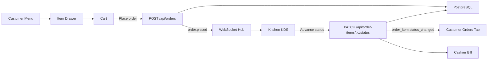

# Project Overview

## Purpose

Build a full-stack restaurant order and payment system for Ethiopian restaurants. The production app is a single Next.js project that owns both frontend screens and backend APIs. It uses PostgreSQL for persistence, Prisma for database access, and a simple Node WebSocket layer for realtime updates.

The first demo tenant is Bole Cafe. Keep the warm cream/orange/navy Lovable theme and role-specific layouts from the prototype.

## Product Shape

One SaaS app serves many restaurants. Every restaurant is addressed by a slug:

| Surface | Route |
| --- | --- |
| Landing / demo hub | `/` |
| Customer QR table | `/r/[slug]/t/[table]` |
| Staff login / role picker | `/r/[slug]/staff` |
| Waiter dashboard | `/r/[slug]/waiter` |
| Kitchen KDS | `/r/[slug]/kitchen` |
| Cashier dashboard | `/r/[slug]/cashier` |
| Owner admin | `/r/[slug]/admin` |

The QR code encodes the full customer URL, for example:

```text
https://order.app.com/r/bole-cafe/t/1
```

## Actors

| Actor | Authentication | Main device | Responsibility |
| --- | --- | --- | --- |
| Customer | No login; QR plus browser `device_token` | Mobile browser | Browse menu, customize items, place orders, view status, pay with mock Telebirr when all items are served. |
| Waiter | Email/password staff login | Tablet | Help guests, open waiter-started sessions, edit assigned/self-assigned tables, handle assistance requests. |
| Kitchen | Shared restaurant kitchen login | Tablet / kitchen display | View live orders by table, advance item status, keep activity log. |
| Cashier | Email/password staff login | Desktop/tablet | View bills, record cash or partial payments, finalize sessions, handle Telebirr verification queue. |
| Owner/Admin | Email/password staff login | Desktop | Manage restaurant setup, menu, inventory, tables, QR codes, staff, settings, and audit log. |

## Tech Stack

Use this stack unless the user explicitly changes direction:

- Next.js App Router with TypeScript.
- React Server Components for read-heavy pages where practical.
- Client components for interactive dashboards, item drawers, cart, KDS, cashier actions, and realtime subscriptions.
- Prisma ORM.
- PostgreSQL.
- Next.js Route Handlers for CRUD APIs.
- Server Actions only for simple form mutations where they reduce boilerplate; Route Handlers remain the main API contract.
- Simple Node WebSocket server integrated with the app runtime or started alongside Next.js in development.
- Mock Telebirr in Phase 1.

## Design Direction

Match the Lovable prototype:

- Background: warm cream, not pure white.
- Primary color: saturated orange for CTAs, menu active tabs, and brand mark.
- Dark surface: deep navy for selected tabs, footer panels, and high-emphasis controls.
- Cards: large radius, soft border, subtle shadow, generous whitespace.
- Customer flow: narrow centered mobile column, thumb-friendly bottom actions.
- Waiter and kitchen: tablet-friendly, large tap targets, status chips, clear empty states.
- Cashier and admin: desktop/tablet density with clean tables and side navigation.
- Language toggle on every surface: English and Amharic.
- Currency shown everywhere as ETB.

## Core Lifecycle



## MVP Rules

- One active session per table.
- One live cart per active session.
- Each Place Order creates a new order under the same session.
- Kitchen and cashier see all orders cumulatively until payment closes the session.
- Customer-started sessions require a browser `device_token`.
- Waiter-started sessions skip device binding.
- Payment is blocked until all order items are served.
- Full Telebirr payment auto-closes the session.
- Any cash involvement requires cashier manual finalization.
- Discounts, real Telebirr, printed receipts, and SaaS super-admin are not in Phase 1.

## Folder Expectations

Recommended high-level structure:

```text
src/
  app/
    r/[slug]/
      t/[table]/
      staff/
      waiter/
      kitchen/
      cashier/
      admin/
    api/
  components/
    customer/
    waiter/
    kitchen/
    cashier/
    admin/
    shared/
  lib/
    auth/
    db/
    realtime/
    i18n/
    money/
  server/
    websocket/
prisma/
  schema.prisma
  seed.ts
```

## Build Principle

Build one actor phase at a time, but keep shared backend contracts stable. The first end-to-end milestone is:

```text
Customer adds Doro Wat -> places order -> Kitchen sees pending item -> Kitchen marks served -> Customer sees served -> Cashier can finalize bill.
```
