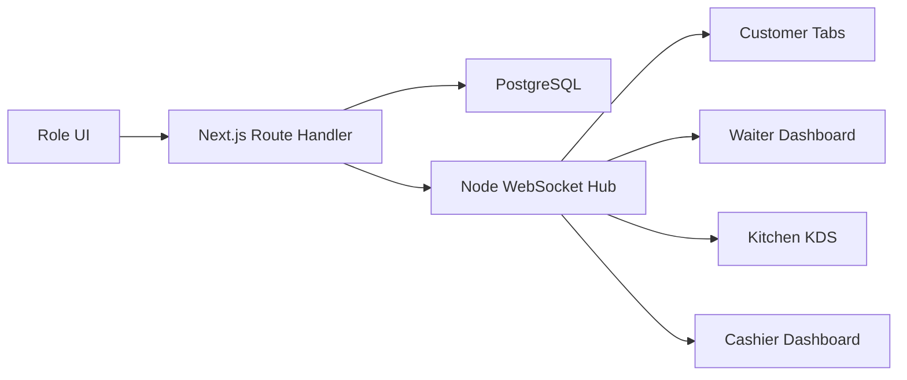

# Realtime Communication Contracts

## Goal

Define how actors communicate without Redis. PostgreSQL is the source of truth. Route Handlers mutate the database, then publish WebSocket events to connected clients. Clients use events to refetch or patch local state.

## Architecture



## No Redis Rule

MVP assumes one app instance. Because there is no Redis/pub-sub:

- WebSocket hub may keep clients in memory.
- Horizontal scaling is out of scope for MVP.
- If the app restarts, clients reconnect and refetch.
- Database remains source of truth.

## WebSocket Connection

Suggested endpoint:

```text
ws://localhost:3001/realtime
```

Production can use:

```text
wss://order.app.com/realtime
```

Client subscribes after connect:

```json
{
  "type": "subscribe",
  "restaurantSlug": "bole-cafe",
  "role": "kitchen",
  "tableNumber": 1
}
```

Subscription fields:

- `restaurantSlug`: required.
- `role`: `customer`, `waiter`, `kitchen`, `cashier`, `admin`.
- `tableNumber`: required only for customer route.
- `sessionId`: optional for narrower customer/cashier subscriptions.

## Event Envelope

Every server event should follow this shape:

```json
{
  "type": "order.placed",
  "restaurantSlug": "bole-cafe",
  "tableNumber": 1,
  "sessionId": "session_id",
  "occurredAt": "2026-06-08T16:15:00.000Z",
  "payload": {}
}
```

## Core Events

### `order.placed`

Published after `POST /api/sessions/[sessionId]/orders`.

Subscribers:

- Kitchen
- Waiter
- Customer for same table
- Cashier

Payload:

```json
{
  "orderId": "order_id",
  "orderNumber": 1004,
  "items": [
    {
      "orderItemId": "item_id",
      "name": "Doro Wat",
      "quantity": 1,
      "kitchenStatus": "PENDING"
    }
  ]
}
```

Client behavior:

- Kitchen inserts/refetches KDS data.
- Customer moves cart result into Orders tab.
- Waiter updates table status.
- Cashier updates session bill.

### `order_item.status_changed`

Published after kitchen advances status.

Subscribers:

- Customer for same table.
- Waiter.
- Kitchen.
- Cashier.

Payload:

```json
{
  "orderItemId": "item_id",
  "orderId": "order_id",
  "from": "PENDING",
  "to": "BEING_PREPARED"
}
```

Client behavior:

- Customer updates Orders tab.
- Kitchen updates chip and activity log.
- Cashier recalculates ready-to-pay state.
- Waiter updates table detail.

### `order_item.cancelled`

Published after waiter cancellation.

Subscribers:

- Kitchen.
- Customer for same table.
- Waiter.
- Cashier.

Payload:

```json
{
  "orderItemId": "item_id",
  "reason": "Customer changed mind",
  "cancelledByStaffId": "staff_id"
}
```

### `assistance.requested`

Published after blocked-device or waiter-started-session assistance request.

Subscribers:

- Waiter.

Payload:

```json
{
  "requestId": "request_id",
  "tableNumber": 1,
  "status": "PENDING",
  "reason": "active_blocked_device"
}
```

### `assistance.updated`

Published when waiter acknowledges or resolves request.

Subscribers:

- Waiter.
- Customer for same table when applicable.

### `payment.updated`

Published when a transaction is created or payment becomes partially paid.

Subscribers:

- Cashier.
- Customer for same table.
- Waiter.

Payload:

```json
{
  "paymentId": "payment_id",
  "status": "PARTIALLY_PAID",
  "totalDue": 1250,
  "totalPaid": 750,
  "balance": 500
}
```

### `payment.completed`

Published when full Telebirr auto-closes or cashier finalizes payment.

Subscribers:

- Customer for same table.
- Cashier.
- Waiter.
- Kitchen.

Client behavior:

- Customer shows receipt and clears local device token.
- Cashier removes session from active list.
- Waiter marks table idle/closed.
- Kitchen removes closed session from active KDS.

### `session.closed`

Can be emitted together with `payment.completed`.

Payload:

```json
{
  "sessionId": "session_id",
  "tableNumber": 1,
  "closedBy": "cashier | telebirr"
}
```

### `menu.availability_changed`

Published when inventory/recipe logic makes item unavailable.

Subscribers:

- Customer.
- Waiter.
- Admin.

Payload:

```json
{
  "menuItemId": "menu_item_id",
  "available": false,
  "reason": "low_stock"
}
```

## Client Strategy

Prefer refetching affected query data after receiving an event. Local patching is okay for obvious UI changes, but database-backed state must win.

Examples:

- Kitchen receives `order.placed`: refetch kitchen orders.
- Customer receives `order_item.status_changed`: refetch session orders.
- Cashier receives `payment.updated`: refetch bill.

## Reconnect Behavior

On disconnect:

- Show small sync indicator.
- Retry connection with exponential backoff.
- On reconnect, resubscribe and refetch current page data.

Do not block local navigation during WebSocket reconnect.

## Security

- WebSocket subscription must be tenant-scoped.
- Staff roles should be verified when subscribing to staff channels.
- Customer can only subscribe to their table/session channel.
- Never send cross-restaurant data.

## Local Development

Recommended commands once project exists:

```text
npm run dev          # Next.js app
npm run dev:ws       # WebSocket server if separate process
```

If using a custom server to run both Next.js and WebSocket together, document that in `package.json` scripts.

## Acceptance Checklist

- Customer placing order updates Kitchen without browser refresh.
- Kitchen status change updates Customer Orders tab.
- Kitchen status change updates Cashier ready-to-pay state.
- Blocked customer request appears in Waiter inbox.
- Payment completion clears Customer token and removes table from active dashboards.
- Reconnect refetches data correctly.
