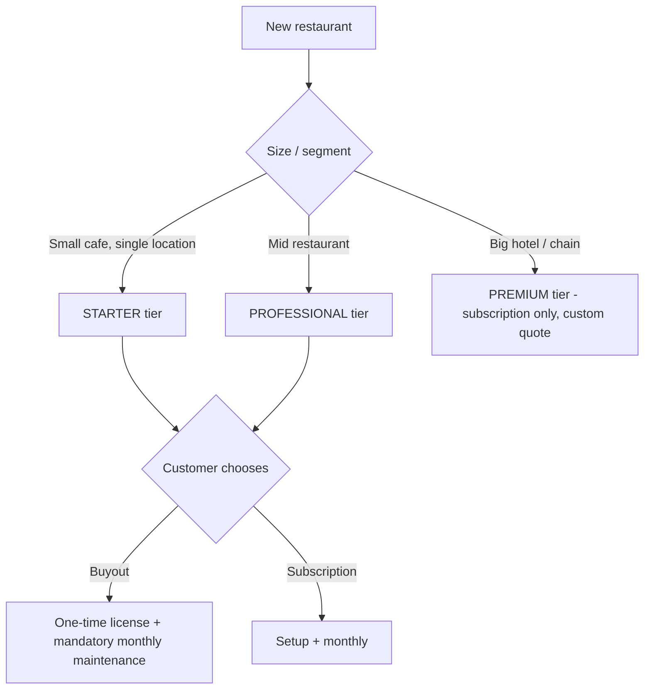

# Monetization and Pricing (Hybrid Model)

> Status: Working pricing reference derived from the monetization meeting brief. Numbers below are recommended anchors to be confirmed/locked in the meeting. All amounts in ETB.

## Model

Hybrid model:

- **Small and mid venues (Starter, Professional):** may choose a one-time "buyout" (perpetual license to use) OR a subscription. Either way a mandatory monthly maintenance fee applies.
- **Large venues (Premium):** subscription only, to protect recurring revenue where the value is highest.

Guardrails:

- **We always host.** "Own it" means a perpetual license to use plus data export rights, NOT self-hosting on the customer's own server. Hosting control keeps the mandatory monthly enforceable (no payment, service suspended).
- The monthly fee is mandatory on every plan, including buyout.

## Tiers and anchor pricing

### Starter (small cafe, single location)

- Subscription path: Setup **5,000** + **800/month**
- Buyout path: **18,000** one-time + **800/month** mandatory maintenance (we host)
- Included:
  - Digital menu
  - QR table ordering
  - Kitchen + cashier order notifications
  - Bilingual menu (English + Amharic)
  - Staff training
  - Basic menu updates (cap: e.g. 4/month)
- Pricing note: a 3,000-5,000 one-time perpetual license gives the product away. The 18,000 buyout plus mandatory monthly keeps it viable while remaining affordable for a small shop.

### Professional (mid restaurant)

- Subscription path: Setup **12,000** + **2,000/month**
- Buyout path: **45,000** one-time + **2,000/month** mandatory maintenance (we host)
- Included (Starter, plus):
  - Custom branding
  - Professional food photography (outsourced, billed as pass-through + markup)
  - Monthly sales report
  - "Unlimited" menu updates (subject to SLA, see policies)
  - Priority support
- Pricing note: buyout anchored at ~2x annual subscription (2,000/month ~= 24,000/year), so 45,000 one-time keeps the perpetual license viable while still rewarding the upfront commitment.

### Premium (big hotel / chain) - subscription only, CUSTOM QUOTE

- Setup from **30,000** + **5,000/month**, quoted per project
- Included (Professional, plus, delivered in phases):
  - Loyalty and rewards program
  - Advanced analytics / reporting dashboard
  - Customer database management
  - Marketing tools / customer engagement
- Pricing note: several Premium features are not built yet (see roadmap). Sell as a phased custom build, not a fixed price for unshipped features.

## Customer segmentation and tier qualification

For Addis Ababa, avoid dividing prospects purely by physical size. Revenue potential, operational complexity, and willingness to pay matter more than table count. Use the target profiles below to place a prospect, then confirm with the scoring grid.

### Starter (target: 800/month, but see pricing note below)

Target customer: small cafes, juice houses, fast-food shops, single-location restaurants, small bakeries, small pizza shops, small cultural restaurants.

Typical characteristics:

- 1 location
- 5-15 tables
- Owner usually involved in daily operations
- Limited menu, few staff
- Little or no existing digital system

Example types: neighborhood coffee shop, small burger shop, small shawarma restaurant, small breakfast cafe.

What they are buying: QR menu, easier ordering, less waiter workload, modern appearance. At their operating costs, 800/month should feel reasonable.

### Professional (target: 2,000/month)

Target customer: established restaurants, popular dining venues, multiple seating areas, businesses with managers and shift supervisors.

Typical characteristics:

- 15-50 tables
- 10-40 employees
- Significant daily order volume
- Frequent menu changes
- Multiple cashiers or service stations
- Strong social media presence

Example types: popular traditional restaurants, mid-sized family restaurants, well-known pizza chains with a few branches, mid-sized high-volume cafes.

What they are buying: operational efficiency, branding, reporting, priority support, better customer experience. At this scale, 2,000/month is small if it prevents even a few mistakes per day.

### Premium (custom quote)

Target customer: hotels, restaurant chains, franchises, large entertainment venues, multi-branch businesses.

Typical characteristics:

- Multiple branches and managers
- Hundreds of orders daily
- Need consolidated reporting and customer retention features
- Often require integrations

Example types: large hotels, restaurant groups, multi-location cafe chains, food courts and large hospitality venues.

What they are buying: centralized management, loyalty programs, analytics, CRM, multi-branch reporting, custom integrations. This is where the real SaaS value lives.

### Scoring grid (repeatable qualification)

Score each prospect on four dimensions instead of relying on subjective judgment:

| Factor | Score 1 | Score 2 | Score 3 |
| --- | --- | --- | --- |
| Branches | 1 | 2-3 | 4+ |
| Tables | <15 | 15-50 | 50+ |
| Daily Orders | <100 | 100-300 | 300+ |
| Staff | <10 | 10-30 | 30+ |

Total score:

- 4-5 points -> Starter
- 6-8 points -> Professional
- 9-12 points -> Premium

### Pricing floor to test (Addis Ababa, 2026)

800 ETB/month may be too cheap once real support, onboarding, menu updates, WhatsApp calls, and on-site visits are factored in. Worth testing higher monthly floors (it is easier to discount during a sale than to raise prices after 50 customers are signed):

| Tier | Setup | Monthly (test) |
| --- | --- | --- |
| Starter | 5,000 | 1,000-1,200 |
| Professional | 12,000 | 2,500-3,000 |
| Premium | Custom | Custom |

MRR impact example: 100 Starter restaurants at 800/month = 80,000 ETB MRR; at 1,200/month = 120,000 ETB MRR - a 50% increase for almost identical operating cost. The bigger risk in Addis is underpricing and becoming a support/menu-update agency for customers who each pay very little.

## Locked policies

1. One-time buyout is offered on **Starter and Professional**. Premium is subscription only.
2. Monthly fee is **mandatory** on all plans, including buyout (covers hosting + support; it is the moat).
3. "Own" means **perpetual license + data export; we always host**. Never self-host on the customer's hardware.
4. **Premium is custom-quote only** until the underlying features are built; do not commit fixed prices for unbuilt features.
5. **Food photography** is billed as pass-through cost + markup.
6. **Annual prepay incentive:** 2 months free on annual prepay to improve cash flow.
7. **Update SLA:** "unlimited" menu updates are capped by turnaround (e.g. 48-72h) + fair-use, to protect margin.

## Money math (to defend the numbers)

- The monthly fee must clear per-tenant hosting plus ~1-2 hrs/month of support time, with margin. 500 ETB likely under-prices time; hold an **800 floor** on Starter.
- One-time setup must cover ~1 day of labor (menu data entry, QR generation/printing, on-site training).
- "Unlimited" anything is a margin leak without an SLA + fair-use cap.
- Buyout logic: a perpetual license should be worth ~1.5-3x annual subscription. At 800/month (~9,600/year), an 18,000 buyout is roughly 2x annual - defensible and still affordable.

## Risks and mitigations

- **Sellout cannibalizes recurring revenue** -> buyout limited to Starter and Professional (Premium stays subscription only) + mandatory monthly + we host.
- **Promising unbuilt Premium features** (reputational/legal risk) -> sell as phased custom build.
- **No billing/onboarding system yet** -> manual invoicing early; fine at low volume, build later (see roadmap).
- **Mock Telebirr only** -> cannot promise live in-production customer payments until real integration is built.
- **Support cost creep** -> SLA + caps on updates/support hours.

## Reality check: what is sellable today

Built / deliverable now: digital menu, QR table ordering, bilingual EN/AM, kitchen KDS + order notifications, cashier flow, admin (menu, inventory, tables, staff, settings), audit log, realtime updates.

Promised but not built (track in `docs/09-build-order-and-checklists.md`): real Telebirr, sales reports / analytics dashboard, loyalty & rewards, customer database management, marketing tools, automated billing + self-serve multi-tenant onboarding.
