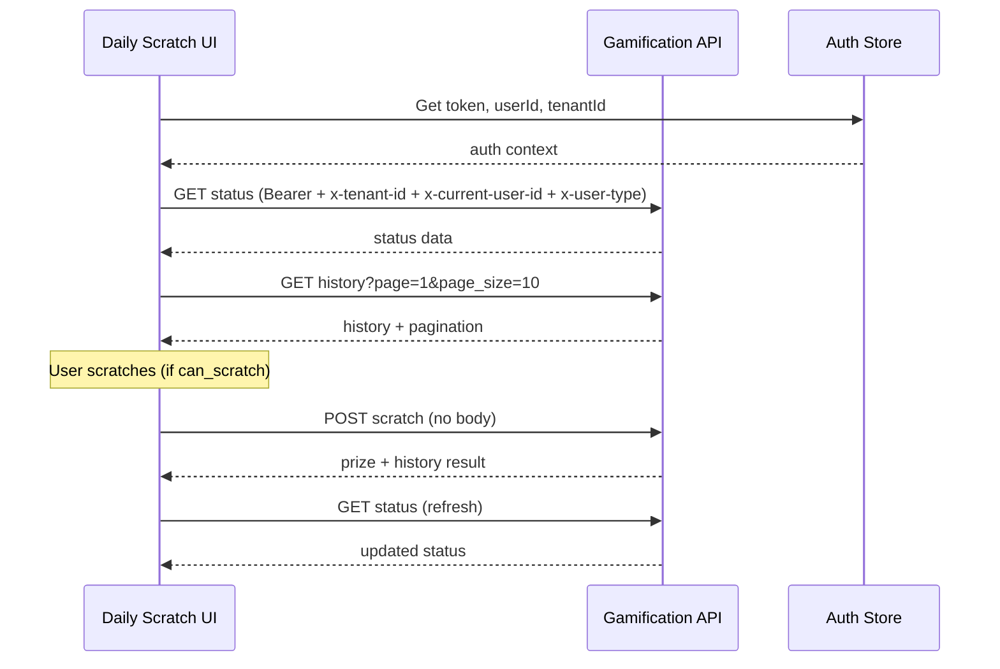

# Daily Scratch — API Integration Spec (Loveable)

> **Purpose:** Wire the existing Daily Scratch UI to three backend endpoints. UI is complete; this document covers API calls, headers, types, state, and error handling only.

---

## Table of Contents

1. [Prerequisites & Configuration](#1-prerequisites--configuration)
2. [Authentication & Headers](#2-authentication--headers)
3. [Shared Response Wrapper](#3-shared-response-wrapper)
4. [TypeScript Types](#4-typescript-types)
5. [API Client Setup](#5-api-client-setup)
6. [Endpoint 1: GET Status](#6-endpoint-1-get-status)
7. [Endpoint 2: POST Scratch](#7-endpoint-2-post-scratch)
8. [Endpoint 3: GET History](#8-endpoint-3-get-history)
9. [Integration Flow (UI Wiring)](#9-integration-flow-ui-wiring)
10. [Error Handling](#10-error-handling)
11. [Testing Checklist](#11-testing-checklist)

---

## 1. Prerequisites & Configuration

### Environment variables

Loveable already has `.env` configured — use the existing API base URL variable from the project (e.g. `VITE_API_BASE_URL`). Do not introduce a new env key unless one is missing.

All endpoint paths below are relative to that base URL.

### Endpoint summary

| Action | Method | Path |
|--------|--------|------|
| Get today's scratch status & calendar config | `GET` | `/api/v1/gamification/player/daily-scratch/status/` |
| Scratch for today (no body) | `POST` | `/api/v1/gamification/player/daily-scratch/scratch/` |
| Scratch history (paginated) | `GET` | `/api/v1/gamification/player/daily-scratch/history/` |

**Business rules:**
- Users can only scratch **for today** (`scratch_date` in status).
- `max_scratches_per_day` is typically `1`; respect `can_scratch`, `remaining_scratches`, and `already_scratched` from status before enabling scratch UI.
- Scratch is only valid when `program_active === true` and `is_configured === true`.

---

## 2. Authentication & Headers

### Bearer token (required on every call)

Every request **must** include:

```
Authorization: Bearer <access_token>
```

Use the existing auth layer / token from login. Do not call these endpoints without a valid token.

### Required headers

| Header | Required | Value | Notes |
|--------|----------|-------|-------|
| `Authorization` | **Yes** | `Bearer <token>` | From existing auth |
| `x-tenant-id` | **Yes** | Tenant UUID | Required for tenant-scoped operations |
| `x-current-user-id` | **Yes** | Authenticated user UUID | Pass `userId` from auth — Loveable already knows where this lives |
| `x-user-type` | **Yes** | `"player"` | Constant for player-facing calls |
| `x-selected-tenant-id` | Optional | Tenant UUID | Send if the app already tracks a selected tenant |
| `x-user-id` | Optional | User UUID | Send if the app already sends this on other API calls |

Header names are lowercase in the API spec (`x-current-user-id`, etc.). Use the same casing your other integrated endpoints use for consistency.

### Header verification checklist

- [ ] `Authorization: Bearer …` on all three calls
- [ ] `x-tenant-id` set on all three calls
- [ ] `x-current-user-id` set on all three calls — value is the authenticated user's ID from auth
- [ ] `x-user-type` is exactly `player`
- [ ] Optional tenant/user headers match whatever the rest of the app already sends

### Example header construction

```typescript
interface DailyScratchAuthContext {
  accessToken: string;
  userId: string;           // pass from existing auth — do not invent a new source
  tenantId: string;
  selectedTenantId?: string;
  userIdHeader?: string;    // x-user-id if your app uses it elsewhere
}

function getDailyScratchHeaders(ctx: DailyScratchAuthContext): HeadersInit {
  const headers: Record<string, string> = {
    "Content-Type": "application/json",
    Authorization: `Bearer ${ctx.accessToken}`,
    "x-tenant-id": ctx.tenantId,
    "x-current-user-id": ctx.userId,
    "x-user-type": "player",
  };

  if (ctx.selectedTenantId) {
    headers["x-selected-tenant-id"] = ctx.selectedTenantId;
  }
  if (ctx.userIdHeader) {
    headers["x-user-id"] = ctx.userIdHeader;
  }

  return headers;
}
```

**Important:** Reuse the same header builder / API client pattern already used for other gamification or player endpoints in this project. Do not create a separate auth path only for daily scratch.

---

## 3. Shared Response Wrapper

### Success envelope

```typescript
interface ApiSuccessResponse<T> {
  success: true;
  message: string;
  errors: ApiErrorItem[];
  data: T;
  pagination?: PaginationMeta; // history only
}
```

### Error envelope

```typescript
interface ApiErrorResponse {
  success: false;
  message: string;
  errors: ApiErrorItem[];
  data?: never;
}

interface ApiErrorItem {
  field: string;
  code: string;       // e.g. "VALIDATION_ERROR"
  message: string;
}

interface PaginationMeta {
  page_number: number;
  page_size: number;
  total_count: number;
  total_pages: number;
}

type ApiResponse<T> = ApiSuccessResponse<T> | ApiErrorResponse;
```

**Integration rule:** Check `success === true` before using `data`. On failure, show `message` and prefer the first `errors[].message` if present.

### Example error response (daily limit)

```json
{
  "success": false,
  "message": "You have reached the daily scratch limit (1).",
  "errors": [
    {
      "field": "",
      "code": "VALIDATION_ERROR",
      "message": "You have reached the daily scratch limit (1)."
    }
  ]
}
```

---

## 4. TypeScript Types

```typescript
// --- Status (GET /status/) ---

export interface DailyScratchStatus {
  calendar_public_id: string;
  calendar_name: string;
  start_date: string;        // "YYYY-MM-DD"
  end_date: string;          // "YYYY-MM-DD"
  scratch_date: string;      // Today's scratch date "YYYY-MM-DD"
  program_active: boolean;
  is_configured: boolean;
  can_scratch: boolean;
  already_scratched: boolean;
  max_scratches_per_day: number;
  scratches_today: number;
  remaining_scratches: number;
  current_streak: number;
  longest_streak: number;
  total_rewards: number;
  unclaimed_rewards: number;
}

// --- History item (GET /history/ and nested in POST /scratch/) ---

export type WinStatus = "won" | "lost";
export type ClaimStatus = "claimed" | "unclaimed";
export type PrizeType = "NOTHING" | string; // extend as backend adds types

export interface DailyScratchHistoryItem {
  public_id: string;
  player_public_id: string;
  calendar_public_id: string;
  calendar_name: string;
  scratch_date: string;
  prize_public_id: string;
  random_number: number;
  won_prize_type: PrizeType;
  prize_label: string;
  prize_detail: Record<string, unknown>;
  claim_status: ClaimStatus;
  claim_date: string;
  win_status: WinStatus;
  created_at: string;
  updated_at: string;
}

// --- Prize (nested in POST /scratch/ success) ---

export interface DailyScratchPrize {
  public_id: string;
  calendar_public_id: string;
  scratch_date: string;
  label: string;
  label_slug: string;
  outcome_type: PrizeType;
  prize_type: PrizeType;
  reward_configuration_public_id: string | null;
  probability: number;
  status: string;
  created_at: string;
  updated_at: string;
}

// --- Scratch result (POST /scratch/ success data) ---

export interface DailyScratchResult {
  prize: DailyScratchPrize;
  history: DailyScratchHistoryItem;
  scratch_date: string;
  random_number: number;
  user_campaign_award_id: string | null;
}

// --- History query filters ---

export interface DailyScratchHistoryParams {
  page?: number;                    // default 1
  page_size?: number;               // default 10
  ordering?: string;                // default "-created_at"
  calendar_public_id?: string;
  scratch_date_from?: string;       // "YYYY-MM-DD"
  scratch_date_to?: string;         // "YYYY-MM-DD"
}
```

---

## 5. API Client Setup

Create or extend the existing API module (e.g. `src/lib/api/dailyScratch.ts`). **Reuse the project's existing fetch/axios wrapper** so Bearer token and tenant headers are applied consistently.

```typescript
const BASE = import.meta.env.VITE_API_BASE_URL; // use existing env key

async function dailyScratchRequest<T>(
  path: string,
  ctx: DailyScratchAuthContext,
  options: RequestInit = {}
): Promise<ApiSuccessResponse<T>> {
  const url = `${BASE}${path}`;

  const response = await fetch(url, {
    ...options,
    headers: {
      ...getDailyScratchHeaders(ctx),
      ...(options.headers ?? {}),
    },
  });

  const json = await response.json() as ApiResponse<T>;

  if (!response.ok || json.success === false) {
    throw new DailyScratchApiError(
      json.message ?? `Request failed (${response.status})`,
      response.status,
      json.errors ?? []
    );
  }

  return json as ApiSuccessResponse<T>;
}

export class DailyScratchApiError extends Error {
  constructor(
    message: string,
    public status: number,
    public errors: ApiErrorItem[] = []
  ) {
    super(message);
    this.name = "DailyScratchApiError";
  }
}
```

---

## 6. Endpoint 1: GET Status

**Load on:** Daily Scratch screen mount, and after a successful scratch (refresh state).

### Request

```
GET /api/v1/gamification/player/daily-scratch/status/
```

- **Body:** none
- **Query params:** none

### Example success response

```json
{
  "success": true,
  "message": "Scratch status retrieved",
  "errors": [],
  "data": {
    "calendar_public_id": "019ecaf7-329f-7368-8b36-97be05c7850c",
    "calendar_name": "DJ",
    "start_date": "2026-06-15",
    "end_date": "2026-07-07",
    "scratch_date": "2026-06-15",
    "program_active": true,
    "is_configured": true,
    "can_scratch": false,
    "already_scratched": true,
    "max_scratches_per_day": 1,
    "scratches_today": 1,
    "remaining_scratches": 0,
    "current_streak": 1,
    "longest_streak": 1,
    "total_rewards": 0,
    "unclaimed_rewards": 0
  }
}
```

### Client function

```typescript
export async function getDailyScratchStatus(ctx: DailyScratchAuthContext) {
  return dailyScratchRequest<DailyScratchStatus>(
    "/api/v1/gamification/player/daily-scratch/status/",
    ctx,
    { method: "GET" }
  );
}
```

### UI mapping

| Field | UI usage |
|-------|----------|
| `calendar_name` | Header / campaign title |
| `start_date`, `end_date` | Calendar range display |
| `scratch_date` | Highlight "today" on calendar |
| `program_active` | If `false`, show inactive / ended state |
| `is_configured` | If `false`, show "not available" |
| `can_scratch` | Primary gate for scratch interaction |
| `already_scratched` | Show completed state / disable scratch |
| `current_streak`, `longest_streak` | Streak badges |
| `total_rewards`, `unclaimed_rewards` | Rewards summary |
| `remaining_scratches` | Optional counter near scratch CTA |

**Scratch button enable logic:**

```typescript
const canInteract =
  status.program_active &&
  status.is_configured &&
  status.can_scratch &&
  !status.already_scratched &&
  status.remaining_scratches > 0;
```

---

## 7. Endpoint 2: POST Scratch

**Trigger on:** User completes scratch gesture / taps "Scratch" (existing UI).

### Request

```
POST /api/v1/gamification/player/daily-scratch/scratch/
```

- **Body:** **none** — do not send `{}`. No body property on the request.
- **Headers:** Bearer + tenant + `x-current-user-id` + `x-user-type: player`

```typescript
export async function postDailyScratch(ctx: DailyScratchAuthContext) {
  return dailyScratchRequest<DailyScratchResult>(
    "/api/v1/gamification/player/daily-scratch/scratch/",
    ctx,
    { method: "POST" }
  );
}
```

### Success response (confirmed)

```json
{
  "success": true,
  "message": "Scratch successful",
  "errors": [],
  "data": {
    "prize": {
      "public_id": "019ecf6e-2dbc-714d-8821-430ea6bc933a",
      "calendar_public_id": "019ecaf7-329f-7368-8b36-97be05c7850c",
      "scratch_date": "2026-06-16",
      "label": "try tomorrow",
      "label_slug": "try-tomorrow",
      "outcome_type": "NOTHING",
      "prize_type": "NOTHING",
      "reward_configuration_public_id": null,
      "probability": 40.0,
      "status": "active",
      "created_at": "2026-06-16T10:56:04.924607+03:00",
      "updated_at": "2026-06-16T10:56:04.924796+03:00"
    },
    "history": {
      "public_id": "019ecf7e-85d4-75d4-90b0-957d7ca48356",
      "player_public_id": "019cbe75-b25c-769c-8966-6ac344e8f615",
      "calendar_public_id": "019ecaf7-329f-7368-8b36-97be05c7850c",
      "calendar_name": "DJ",
      "scratch_date": "2026-06-16",
      "prize_public_id": "019ecf6e-2dbc-714d-8821-430ea6bc933a",
      "random_number": 70,
      "won_prize_type": "NOTHING",
      "prize_label": "try tomorrow",
      "prize_detail": {},
      "claim_status": "claimed",
      "claim_date": "2026-06-16",
      "win_status": "lost",
      "created_at": "2026-06-16T11:13:56.052795+03:00",
      "updated_at": "2026-06-16T11:13:56.052948+03:00"
    },
    "scratch_date": "2026-06-16",
    "random_number": 70,
    "user_campaign_award_id": null
  }
}
```

### Which fields to display in the result UI

Use **`data.history`** as the primary source for win/lose outcome and user-facing prize text:

| UI element | Field to use | Example |
|------------|--------------|---------|
| Win / lose state | `data.history.win_status` | `"won"` → win animation; `"lost"` → lose / try again |
| Prize label (main text) | `data.history.prize_label` | `"try tomorrow"` |
| Prize type / icon | `data.history.won_prize_type` | `"NOTHING"` |
| Claim state chip | `data.history.claim_status` | `"claimed"` |
| Scratch date | `data.scratch_date` or `data.history.scratch_date` | `"2026-06-16"` |
| Random number (reveal animation) | `data.random_number` | `70` |
| Campaign name | `data.history.calendar_name` | `"DJ"` |

Use **`data.prize`** for prize configuration detail if the UI shows it:

| UI element | Field to use |
|------------|--------------|
| Display label (fallback) | `data.prize.label` |
| Slug / routing | `data.prize.label_slug` |
| Outcome type | `data.prize.outcome_type` or `data.prize.prize_type` |

**Win detection helper:**

```typescript
function isScratchWin(result: DailyScratchResult): boolean {
  return result.history.win_status === "won";
}

function getScratchResultLabel(result: DailyScratchResult): string {
  return result.history.prize_label || result.prize.label;
}
```

### Post-scratch flow

1. Call `POST /scratch/` (no body).
2. On success, drive result modal/animation from `data.history` (`win_status`, `prize_label`, `won_prize_type`, `random_number`).
3. Call `GET /status/` to refresh `already_scratched`, streaks, and rewards.
4. Refresh history if the history panel is visible (prepend `data.history` or re-fetch).

### Error cases

| Condition | UX |
|-----------|-----|
| Daily limit reached | Show `message`: *"You have reached the daily scratch limit (1)."* — then refresh status |
| Program inactive / not configured | Disable scratch; show status message |
| 401 / 403 | Redirect to login / refresh token |
| Network failure | Retry CTA |

---

## 8. Endpoint 3: GET History

**Load on:** History tab/section mount, pull-to-refresh, pagination.

### Request

```
GET /api/v1/gamification/player/daily-scratch/history/
```

### Query parameters

| Param | Type | Default | Description |
|-------|------|---------|-------------|
| `page` | integer | `1` | Page number (1-based) |
| `page_size` | integer | `10` | Items per page |
| `ordering` | string | `-created_at` | Sort field; prefix `-` for descending |
| `calendar_public_id` | uuid | — | Filter by calendar |
| `scratch_date_from` | date | — | Include scratches on or after (inclusive) |
| `scratch_date_to` | date | — | Include scratches on or before (inclusive) |

### Client function

```typescript
export async function getDailyScratchHistory(
  ctx: DailyScratchAuthContext,
  params: DailyScratchHistoryParams = {}
) {
  const searchParams = new URLSearchParams();

  searchParams.set("page", String(params.page ?? 1));
  searchParams.set("page_size", String(params.page_size ?? 10));
  searchParams.set("ordering", params.ordering ?? "-created_at");

  if (params.calendar_public_id) {
    searchParams.set("calendar_public_id", params.calendar_public_id);
  }
  if (params.scratch_date_from) {
    searchParams.set("scratch_date_from", params.scratch_date_from);
  }
  if (params.scratch_date_to) {
    searchParams.set("scratch_date_to", params.scratch_date_to);
  }

  return dailyScratchRequest<DailyScratchHistoryItem[]>(
    `/api/v1/gamification/player/daily-scratch/history/?${searchParams}`,
    ctx,
    { method: "GET" }
  );
}
```

### Example success response

```json
{
  "success": true,
  "message": "Scratch history retrieved",
  "errors": [],
  "pagination": {
    "page_number": 1,
    "page_size": 10,
    "total_count": 1,
    "total_pages": 1
  },
  "data": [
    {
      "public_id": "019ecf6f-35a7-77f1-b4bb-f72f1a6a0c12",
      "player_public_id": "019cbe75-b25c-769c-8966-6ac344e8f617",
      "calendar_public_id": "019ecaf7-329f-7368-8b36-97be05c7850c",
      "calendar_name": "DJ",
      "scratch_date": "2026-06-16",
      "prize_public_id": "019ecf6e-2dbc-714d-8821-430ea6bc933a",
      "random_number": 71,
      "won_prize_type": "NOTHING",
      "prize_label": "try tomorrow",
      "prize_detail": {},
      "claim_status": "claimed",
      "claim_date": "2026-06-16",
      "win_status": "lost",
      "created_at": "2026-06-16T10:57:12.487081+03:00",
      "updated_at": "2026-06-16T10:57:12.487237+03:00"
    }
  ]
}
```

**Note:** Request uses `page` / `page_size`; response pagination uses `page_number` / `page_size` / `total_count` / `total_pages`.

### History list UI mapping

| Field | UI usage |
|-------|----------|
| `scratch_date` | Row date |
| `prize_label` | Primary text |
| `win_status` | Win/lose badge (`"won"` / `"lost"`) |
| `won_prize_type` | Icon or category |
| `claim_status` | Claimed vs unclaimed chip |
| `calendar_name` | Subtitle / campaign name |
| `random_number` | Optional detail |

### Pagination

```typescript
const res = await getDailyScratchHistory(ctx, { page: 1, page_size: 10 });
const { data, pagination } = res;

const currentPage = pagination?.page_number ?? 1;
const hasMore = pagination ? currentPage < pagination.total_pages : false;
```

### Optional: filter history by active calendar

If status is loaded, pass `calendar_public_id` from status when fetching history:

```typescript
await getDailyScratchHistory(ctx, {
  page: 1,
  page_size: 10,
  calendar_public_id: status.calendar_public_id,
});
```

---

## 9. Integration Flow (UI Wiring)

### Suggested React hook: `useDailyScratch`

Pass auth context from the existing auth layer — **pass `userId` from wherever the app already reads it after authentication**.

```typescript
export function useDailyScratch(ctx: DailyScratchAuthContext | null) {
  const [status, setStatus] = useState<DailyScratchStatus | null>(null);
  const [history, setHistory] = useState<DailyScratchHistoryItem[]>([]);
  const [pagination, setPagination] = useState<PaginationMeta | null>(null);
  const [loading, setLoading] = useState(true);
  const [scratching, setScratching] = useState(false);
  const [error, setError] = useState<string | null>(null);
  const [lastResult, setLastResult] = useState<DailyScratchResult | null>(null);

  const loadStatus = async () => {
    if (!ctx) return;
    const res = await getDailyScratchStatus(ctx);
    setStatus(res.data);
  };

  const loadHistory = async (page = 1) => {
    if (!ctx) return;
    const res = await getDailyScratchHistory(ctx, {
      page,
      page_size: 10,
      calendar_public_id: status?.calendar_public_id,
    });
    setHistory(res.data);
    setPagination(res.pagination ?? null);
  };

  const scratch = async () => {
    if (!ctx || scratching) return;
    setScratching(true);
    setError(null);
    try {
      const res = await postDailyScratch(ctx);
      setLastResult(res.data);
      await loadStatus();
      await loadHistory(1);
    } catch (e) {
      setError(handleScratchError(e));
      // If daily limit error, refresh status so UI shows already_scratched
      if (e instanceof DailyScratchApiError && e.errors.some(er => er.code === "VALIDATION_ERROR")) {
        await loadStatus();
      }
    } finally {
      setScratching(false);
    }
  };

  useEffect(() => {
    if (!ctx) {
      setLoading(false);
      return;
    }
    (async () => {
      setLoading(true);
      try {
        await loadStatus();
        await loadHistory(1);
      } catch (e) {
        setError(handleScratchError(e));
      } finally {
        setLoading(false);
      }
    })();
  }, [ctx?.userId, ctx?.tenantId]);

  return {
    status,
    history,
    pagination,
    loading,
    scratching,
    error,
    lastResult,
    scratch,
    reloadStatus: loadStatus,
    reloadHistory: loadHistory,
    isWin: lastResult ? isScratchWin(lastResult) : false,
    resultLabel: lastResult ? getScratchResultLabel(lastResult) : null,
  };
}
```

### Screen-level sequence



### Wire to existing UI (checklist)

- [ ] Replace mock/static status with hook `status`
- [ ] Scratch gesture/button calls `scratch()` — not a mock delay
- [ ] Result modal uses `lastResult.history.win_status` for win/lose
- [ ] Result text uses `lastResult.history.prize_label` (fallback: `lastResult.prize.label`)
- [ ] Prize type/icon uses `lastResult.history.won_prize_type`
- [ ] Reveal animation can use `lastResult.random_number`
- [ ] Disabled state uses `can_scratch` / `already_scratched` from status
- [ ] History list uses `history` array — each row: `prize_label`, `win_status`, `scratch_date`
- [ ] "Load more" uses `pagination.total_pages` and request param `page` (not `page_number`)
- [ ] Loading: `loading` on mount, `scratching` during POST
- [ ] Errors: show `error` toast/banner; daily limit message from API
- [ ] Streak/rewards: `current_streak`, `longest_streak`, `total_rewards`, `unclaimed_rewards`
- [ ] All calls include Bearer token + `x-tenant-id` + `x-current-user-id` + `x-user-type: player`

---

## 10. Error Handling

```typescript
function handleScratchError(error: unknown): string {
  if (error instanceof DailyScratchApiError) {
    const firstError = error.errors[0];
    if (firstError?.message) return firstError.message;

    if (error.status === 401 || error.status === 403) {
      return "Please log in again.";
    }
    return error.message;
  }
  if (error instanceof Error) return error.message;
  return "Something went wrong. Please try again.";
}
```

On `VALIDATION_ERROR` with daily limit message, refresh status and keep scratch UI in completed state.

---

## 11. Testing Checklist

### Headers & auth

- [ ] `Authorization: Bearer …` on all three calls
- [ ] `x-tenant-id` on all three calls
- [ ] `x-current-user-id` matches authenticated user
- [ ] `x-user-type: player` on all three calls

### Status

- [ ] Fresh user: `can_scratch: true`, `already_scratched: false`
- [ ] After scratch: `can_scratch: false`, `already_scratched: true`
- [ ] Streak counters update after scratch

### Scratch

- [ ] POST has **no request body**
- [ ] Success shows `history.prize_label` and correct `history.win_status`
- [ ] Double-scratch returns daily limit error; UI refreshes to completed state

### History

- [ ] Request uses `page` and `page_size` query params
- [ ] Response pagination uses `page_number`, `total_pages`
- [ ] New scratch appears after refresh
- [ ] Empty history shows empty state

---

## Quick Reference

```
GET  /api/v1/gamification/player/daily-scratch/status/
POST /api/v1/gamification/player/daily-scratch/scratch/          (no body)
GET  /api/v1/gamification/player/daily-scratch/history/?page=1&page_size=10&ordering=-created_at
```

**Required on every call:**

```
Authorization: Bearer <token>
x-tenant-id: <tenant-uuid>
x-current-user-id: <userId from auth>
x-user-type: player
```

**Result UI fields (POST success):**

```
win/lose     → data.history.win_status
label        → data.history.prize_label
prize type   → data.history.won_prize_type
random       → data.random_number
campaign     → data.history.calendar_name
```
